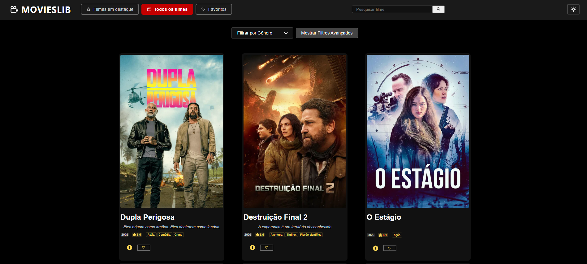

# Movies Lib



## 📖 Sobre

**Movies Lib** é uma biblioteca de filmes interativa desenvolvida com React. Utilizando a API do [The Movie Database (TMDB)](https://www.themoviedb.org/), a aplicação permite que os usuários descubram, pesquisem e salvem seus filmes favoritos em um só lugar.

O projeto conta com um design moderno e responsivo, adaptando-se a diferentes tamanhos de tela, e oferece temas claro (light) e escuro (dark) para uma experiência de visualização confortável.

---

## ✨ Funcionalidades

O **Movies Lib** oferece uma experiência rica e completa para os amantes de cinema:

- 🎬 **Exploração de Filmes**
  - Navegue pela página inicial para ver os filmes mais populares do momento.
  - Acesse uma grade com todos os filmes disponíveis, com paginação para facilitar a descoberta.

- 🔎 **Busca e Filtros Inteligentes**
  - Utilize a barra de pesquisa para encontrar filmes específicos pelo nome com sugestões em tempo real.
  - Refine sua busca com filtros avançados por gênero, ano de lançamento ou avaliação dos usuários.

- ℹ️ **Página de Detalhes Completa**
  - Clique em um filme para acessar informações detalhadas, incluindo o pôster, sinopse, duração, orçamento, e muito mais.

- ❤️ **Gerenciamento de Favoritos**
  - Marque seus filmes preferidos com um clique e acesse-os rapidamente em uma página dedicada.

- 📱 **Experiência de Usuário Premium**
  - Desfrute de um design totalmente responsivo que se adapta perfeitamente a desktops, tablets e celulares.
  - Alterne entre o tema claro (light) e escuro (dark) para uma visualização mais confortável a qualquer hora do dia.

---

## 🚀 Tecnologias Utilizadas

- **[React](https://react.dev/)**: Biblioteca para construção da interface de usuário.
- **[Vite](https://vitejs.dev/)**: Ferramenta de build e desenvolvimento rápido.
- **[React Router DOM](https://reactrouter.com/en/main)**: Para gerenciamento de rotas na aplicação.
- **[React Icons](https://react-icons.github.io/react-icons/)**: Para ícones modernos e personalizáveis.

---

## ⚙️ Como Executar o Projeto

Siga os passos abaixo para rodar o projeto em seu ambiente de desenvolvimento.

### Pré-requisitos

- [Node.js](https://nodejs.org/en) (versão 16 ou superior)
- [npm](https://www.npmjs.com/) ou [Yarn](https://yarnpkg.com/)
- Uma chave de API do [TMDB](https://www.themoviedb.org/documentation/api)

### Passos

1. **Clone o repositório:**
   ```bash
   git clone https://github.com/rodrisoares/movies-lib.git
   ```

2. **Acesse o diretório do projeto:**
   ```bash
   cd movies-lib
   ```

3. **Instale as dependências:**
   ```bash
   npm install
   ```

4. **Configure as variáveis de ambiente:**
   - Crie um arquivo `.env` na raiz do projeto.
   - Copie o conteúdo do arquivo `.env.example` e cole no `.env`.
   - Substitua o valor de `VITE_API_KEY` pela sua chave de API do TMDB:
     ```env
     VITE_API_KEY=SUA_CHAVE_DE_API_AQUI
     VITE_API=https://api.themoviedb.org/3/movie/
     VITE_SEARCH=https://api.themoviedb.org/3/search/movie
     VITE_IMG=https://image.tmdb.org/t/p/w500/
     ```

5. **Execute a aplicação:**
   ```bash
   npm run dev
   ```

A aplicação estará disponível em `http://localhost:5173` (ou em outra porta, caso a 5173 esteja em uso).

---
